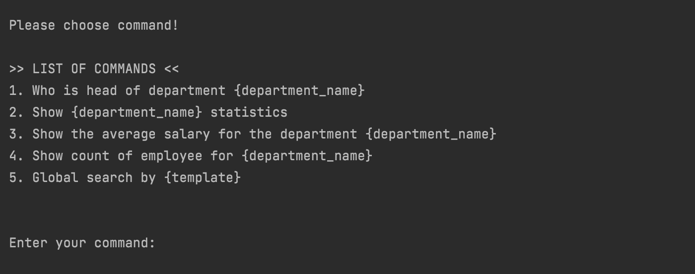
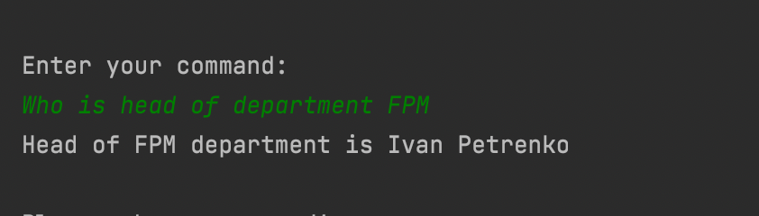
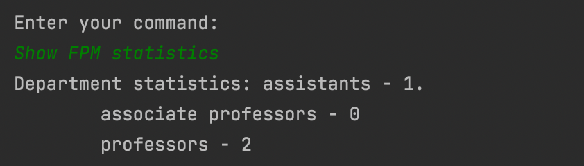
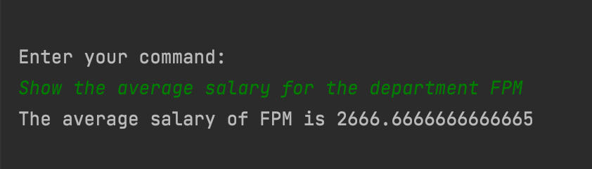

# University CLI manager

### The app implemented such commands:

### Interaction with program functionality:

####1. Who is head of department {department_name}

####2. Show {department_name} statistics.

####3. Show the average salary for the department {department_name}.

####4. Show count of employee for {department_name}.

####5. Global search by {template}.  

